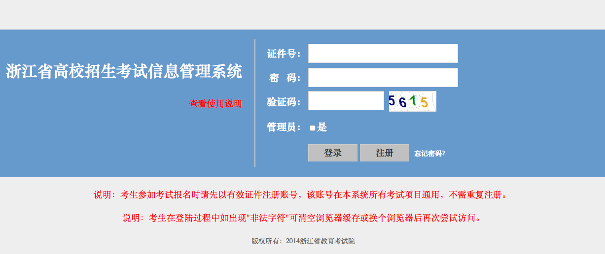
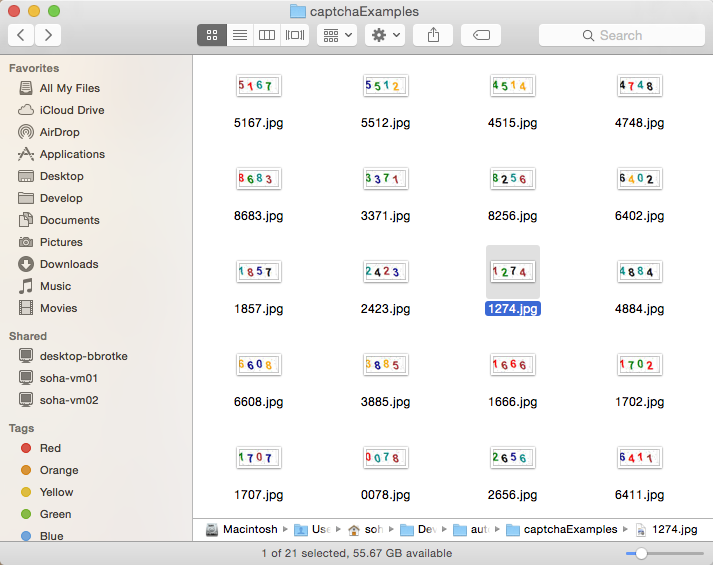
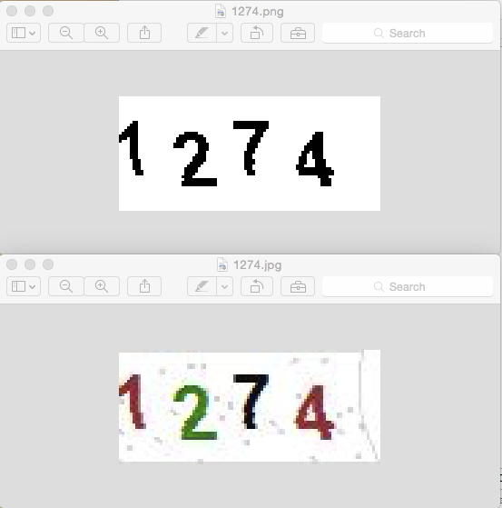
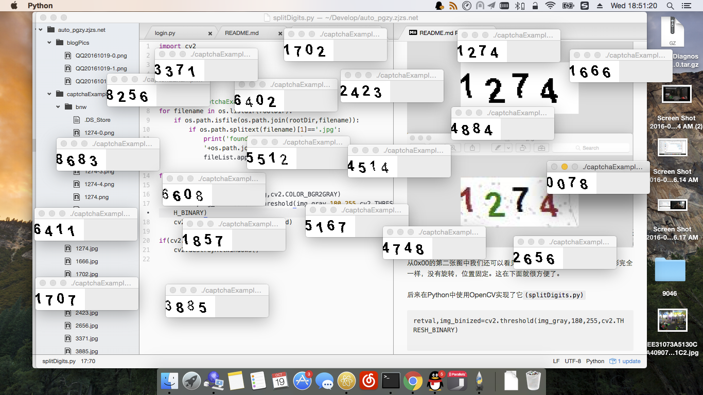
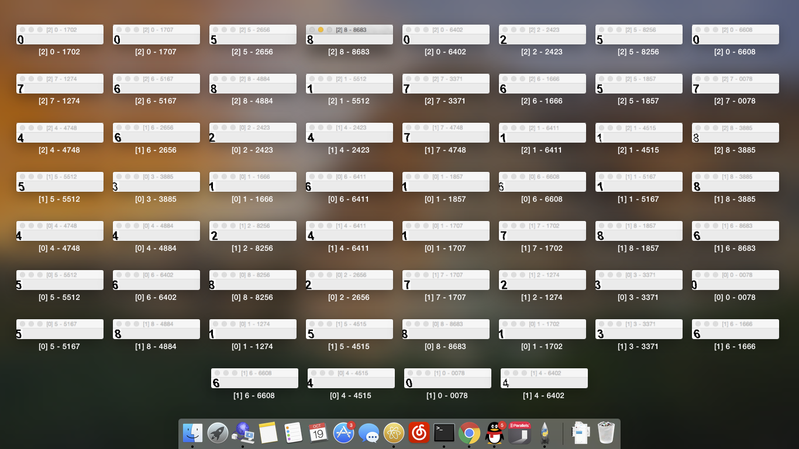
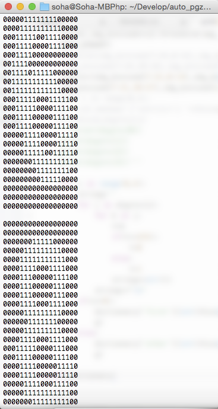
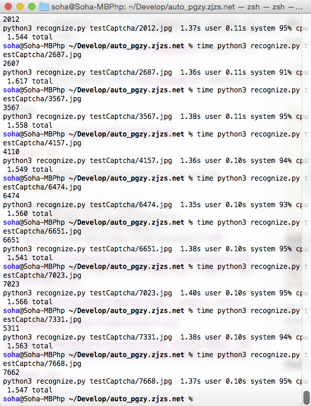
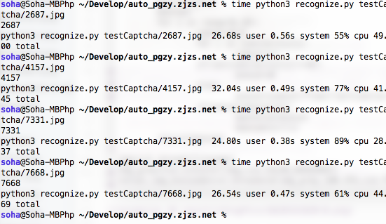
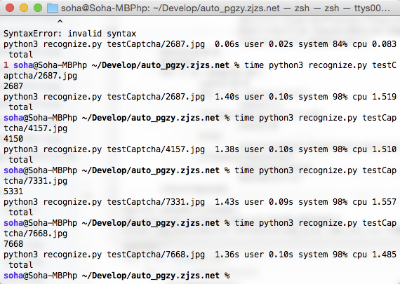

# 自动登录浙江省高校招生考试信息管理系统

刚刚经历了浙江省的2016年10月学考选考，但不知道什么时候出成绩，于是我决定写一个自动查询的脚本。

### 0x00 准备

首先我打开了http://pgzy.zjzs.net:8011/login.htm ，仔细观察了它的验证码。

看了一下这个验证码的干扰因子很少，应该很方便识别。为了研究，我用wget下载了20个验证码。

	wget http://pgzy.zjzs.net:8011/INC/VerifyCode.aspx -O $(date +%s).jpg

这里为了试验，我把20个验证码全部重命名过了。

这里打算使用的语言是<del>交易</del>Python 3，并装好opencv和diff-match-patch。

本来想使用TensorFlow，但是我怕我在研究怎么使用它上会花费大量时间，于是使用了最机械的方法。

### 0x01 图片处理

看着这些验证码我很自然想到了要先二值化，这里就交给ImageMagick了。

	convert captchaExamples/1274.jpg -fuzz 50% -fill white -opaque white -fill black +opaque white captchaExamples/bnw/1274.png

因为这个验证码真的很棒，不费一点力气就完美了。

从0x00的第二张图中我们还可以看见一些好玩的东西：这些验证码字形完全一样，没有旋转，位置固定。这在下面就很方便了。

后来在Python中使用OpenCV实现了它(`splitDigits.py`)

	retval,img_binized=cv2.threshold(img_gray,180,255,cv2.THRESH_BINARY)

Python运行结果：

### 0x02 切割

接下来是把验证码4位裁剪出来。使用一些工具，可以得出第一位基本上分辨率是14x24，其他三位是18x24。然后得出每个起始x的y的值，最后我们每一张图可以用这句话分离出来。(`splitDigits.py`)

	digits=[
		img_binized[7:31,0:14],
		img_binized[12:36,18:36],
		img_binized[7:31,39:57],
		img_binized[12:36,62:80]
	]

效果差不多是这样：

### 0x03 建库

还是因为这个验证码的生成逻辑太简单了，识别什么的我们完全可以通过一个图形数据库完成。

本来是想比对图片相似度的，经过zsx的提醒，我决定输出一个0和1组成的字符串，然后比对字符串之间的相似度。

第一位要特殊处理，因为第一位少了4个像素。

本身OpenCV中的数据存储就是一个array，因此通过这段代码就可以得到字模。(`splitDigits.py`)

	for i in range(0,4):
		string=''
		for j in digits[i]:
			for k in j:
				t=k
				if(t==255):
					t=0
				else:
					t=1
				string+=str(t)
			string+="\n"
		if(i==0):
			dictionary['first'][int(thisid[i])].append(string)
		else:
			dictionary['other'][int(thisid[i])].append(string)

效果不错。

### 0x04 识别

这里主要看文本相似度。这里使用Google的diff-match-patch库。(`recognize.py`)

	diffs=dmp.diff_main(j,imgstr)
	diffvalue=dmp.diff_levenshtein(diffs)
	maxLength=max(len(j),len(imgstr))
	smlrt=(1-float(diffvalue)/float(maxLength))*100

这是使用Levenshtein算法的比较部分的核心代码，实际测试中发现这个速度非常慢，需要耗时12秒。后来改用Python自带的difflib，只需要1s。于是我临时决定改用difflib。

	smlrt=difflib.SequenceMatcher(None,j,imgstr).ratio()

我又下载了几个验证码放在testCaptcha文件夹里，他们不会用做样本，只是拿来检测成功率。有意思的是，100个样本加上这10个测试图，一个9都没有。

我们可以看到识别结果有点不尽如人意了。我觉得是之前的相似度算法的问题，于是我用Levenshtein的算法又试了一遍。

可以看见，之前爆炸的几个都正确了。但是因为我增加了样本数量（20->100）Levenshtein算法需要26+s了，这简直太可怕。

如果我直接比对相似度而不是看每个数字的绝对值呢？于是我调整了相似度最大值获取部分的代码。还是有两个出不来。

我选择死亡。但是打码浪费20+s是不可能的。好在登录错误也没有限制，如果返回验证码错误就再请求一个进行识别好了。

### 0x05 应用

这就是用urllib POST数据的事了。欢迎看仓库里的login.py
